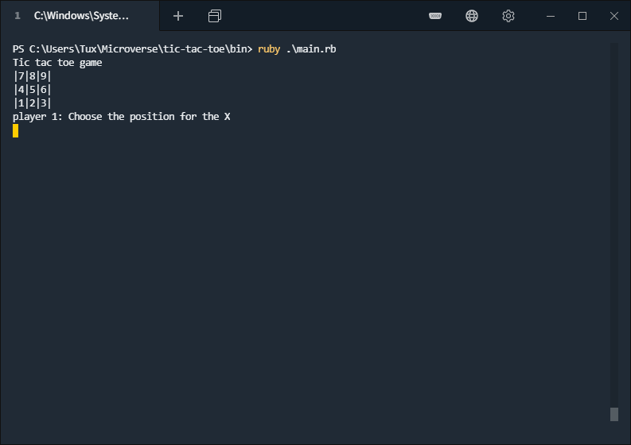
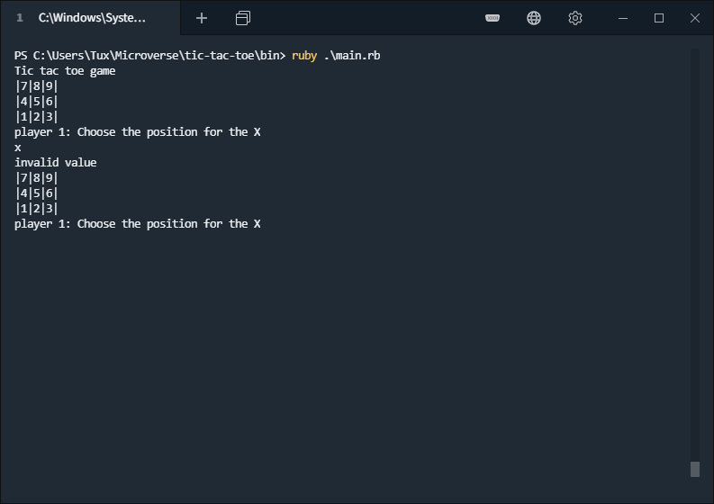
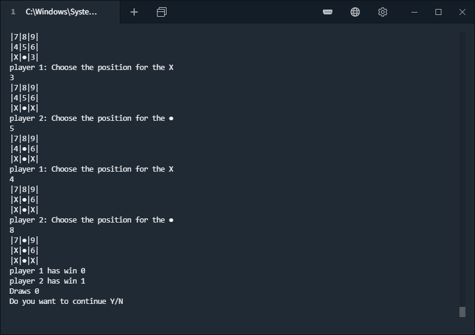

# tic-tac-toe

  Ruby based tic tac toe game
​
## Built With
​
- Ruby 2.6.5
​

## Getting Started
​
  To get a local copy up and running follow these simple example steps.

  Clone the project using the next command:
  `​git clone https://github.com/AdfPizarro/tic-tac-toe`

  Start the game typing the next command in terminal:
  `bin/main.rb`

​
### Instructions
​
 The goal of the game is to fill a line with your symbol  'X' or '●' can be
 horizontal, vertical or diagonal
 before the other player, by turns each one will select one cell in the
 board.

 

 You can select the numbers from 1-9 that represents one cell in the board
 if you select an invalid number or a cell that was already taken the
 game will ask you again until you provide a valid option

  

 The game will end when one player complete a line, the game will keep the
 score and you can play as many times you want

   

  You can close the game anytime by typing `Ctrl + c ` or by closing the console

​
## Commands

# rubocop
​
Note: You need to do `bundle install` before executing the commands above.

# Unit test (Rspec)

 

To run the unit testings you will need to install the gem rspect with the following command

`gem install rspec`

To see the test results run the following command

`rspec --format documentation`

​
## Authors
​
👤 **Adrian Flores Pizarro**
​
- Github: [@AdfPizarro](https://github.com/AdfPizarro)
- Twitter: [@AdfPizarro](https://twitter.com/adfpizarro)
- Linkedin: [adrian-flores-pizarro-73b62316a](https://www.linkedin.com/in/adrian-flores-pizarro-73b62316a/)
​

👤 **Yahir Cardona**

- Github: [@yahir91](https://github.com/yahir91)
- Twitter: [@YahirCardona3](https://twitter.com/YahirCardona3)
- Linkedin: [linkedin](https://www.linkedin.com/in/osmar-yahir-cardona-reyes-54b40b1a7/)

## �� Contributing
​
Contributions, issues and feature requests are welcome!
​
Feel free to check the [issues page](issues/).
​
## Show your support
​
Give a ⭐️ if you like this project!
​
## Acknowledgments

​- This project was part of Microverse's curriculum in Ruby learning program
- Hat tip to anyone whose code was used
- Inspiration
- etc
​
## �� License
​
This project is [MIT](lic.url) licensed.
